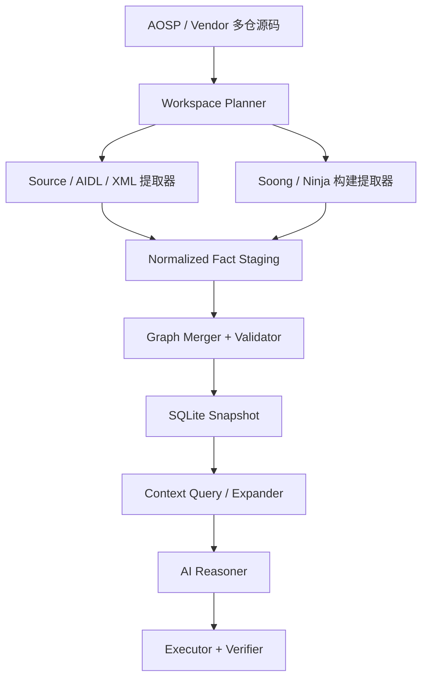
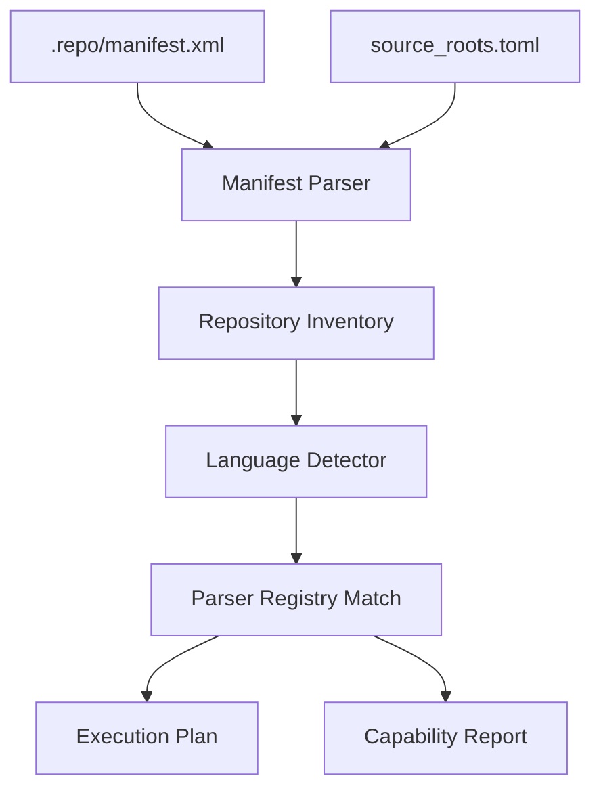
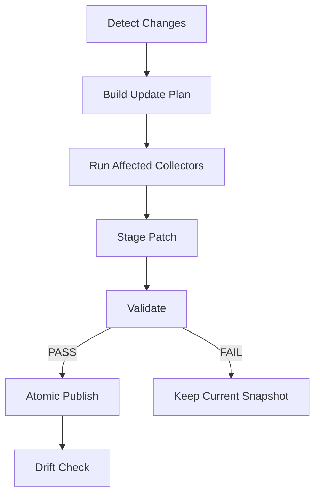

# Android / AOSP Context Graph 最终技术方案

> 文档状态：可实施基线（v1.0）  
> 基线环境：WSL2 + Ubuntu 24.04，AOSP 位于 `/home/ts/aosp`，项目位于 `/home/ts/android-context-intelligence`  
> 首期范围：先完成 **Multi-Repository Source Configuration v0.1**，再完成 **Permission Enforcement Graph v0.1**；Soong/Ninja 构建事实作为 Permission v0.1 的前置子任务接入。

---

## 1. 最终结论

### 1.1 已确定的技术决策

| 编号 | 决策 | 结论 |
|---|---|---|
| D-01 | 图谱事实如何生成 | 由确定性工具生成；AI 不创建基础事实，只做检索、推理、计划和验证闭环 |
| D-02 | 首期存储 | `SQLite + NetworkX`；不在 MVP 阶段引入 Neo4j 集群 |
| D-03 | 首期仓库模型 | 从 `.repo/manifest.xml` 自动发现仓库，由 `config/source_roots.toml` 覆盖配置 |
| D-04 | 多仓改造范围 | 直接把现有 Java Symbol、AIDL/Binder、Java Inheritance、Service Registration 四层改成多仓输入 |
| D-05 | 语言缺口处理 | 默认跳过缺少解析器的语言并生成结构化能力报告；只有 `--strict` 或 `--strict-capability` 才失败 |
| D-06 | v0.1 语言能力 | 检测 Java、AIDL、Kotlin、C、C++、Rust、HIDL、Python、Blueprint、Make、Proto；语义导入先支持 Java/AIDL |
| D-07 | Build Graph 事实源 | Soong 的解析后模块图/动作图为模块语义主源，Ninja 为最终 action/文件依赖主源，`Android.bp` 文本只保留声明事实 |
| D-08 | CodeQL 定位 | 不作为 v0.1 基础图谱的必需组件；后续按需提供精确 call graph、data flow、权限传播和影响分析 |
| D-09 | 首个领域图 | Permission / Binder / Build Context Graph；先支持 `frameworks/base/core` 与 `frameworks/base/services` 的重点链路，再自然扩展多仓 |
| D-10 | 项目落盘位置 | AOSP 和项目均放在 WSL2 Linux 文件系统中，不放在 `/mnt/c`，避免大仓扫描和构建性能问题 |

### 1.2 推荐组合

```text
repo manifest + TOML workspace planner
        |
Universal Ctags + AIDL/Java 专用解析器
        |
Soong module graph/actions + Ninja dependency tools
        |
XML / SELinux / Runtime / Test collectors
        |
Normalized Fact JSONL
        |
SQLite Graph + Snapshot / Incremental Updater
        |
Context Expander
        |
AI Reasoner + Deterministic Verifier
```

CodeQL、SCIP、Joern 是增强层，不是首版启动条件：

- **SCIP**：大规模 definition/reference 和跨仓导航增强。
- **CodeQL**：Java/Kotlin/C/C++ 的精确 call/data flow 查询；尤其适合权限检查、Binder caller identity 和修改影响分析。
- **Joern**：Native Binder、HAL、daemon 和 C/C++ 安全链路。
- **Tree-sitter/专用 parser**：Android.bp、AIDL、XML、SELinux 等 Android 特有格式。
- Understand Anything、CodeWiki、Graphify、GitNexus 可用于对比、浏览或上层交互，但不作为本项目的权威事实源。

---

## 2. 项目目标与边界

### 2.1 首期必须回答的问题

1. 某个 Java/AIDL 符号属于哪个 repo、文件和声明位置？
2. 某个 Manager API 经由哪个 AIDL 接口进入哪个 System Service？
3. System Service 以什么 Binder 名称或 LocalServices key 注册？
4. 某个方法执行了哪些 Permission/AppOps/跨用户校验？
5. 权限在哪里声明、授予或限制？
6. 某个源文件属于哪个 Soong 模块，生成哪个 jar/APEX/可执行文件，安装到哪个分区？
7. 修改一个文件后，需要重建哪些模块或镜像？
8. 任一节点/边由哪个提取器、哪个源码快照、哪一行或哪个构建产物证明？

### 2.2 MVP 不做的内容

- 不一次性覆盖整个 Android 所有语言的完整语义。
- 不让 AI 自动生成或修补基础图谱事实。
- 不在 v0.1 做全量多 Agent 协商系统。
- 不把 CodeQL 当作普通 AST 导出器全量灌库。
- 不把原始 `Android.bp` 中声明的依赖等同于当前 product/variant 的实际依赖。
- 不在首期引入 Kafka、分布式计算或多节点图数据库。

---

## 3. 总体架构



系统分为六层：

1. **Workspace 层**：发现多仓、识别语言、匹配解析器能力、生成执行计划。
2. **Fact Collector 层**：只产生可复现事实，不做开放式推理。
3. **Normalization 层**：统一节点、边、ID、路径和 provenance。
4. **Graph 层**：事务导入、约束验证、快照、diff、增量 patch。
5. **Context 层**：从大图中按问题选择子图，不修改事实。
6. **Reasoning/Loop 层**：提出假设、采集证据、执行构建/测试，并由外部结果验证。

---

## 4. 最终项目目录

```text
/home/ts/android-context-intelligence/
├── README.md
├── pyproject.toml
├── Makefile
├── .gitignore
│
├── config/
│   ├── source_roots.toml
│   ├── parser_registry.toml
│   ├── graph_schema.toml
│   ├── build_products.toml
│   └── android_versions/
│       ├── android14.toml
│       ├── android15.toml
│       └── android16.toml
│
├── workspace/
│   ├── models.py
│   ├── config.py
│   ├── manifest.py
│   ├── languages.py
│   ├── registry.py
│   ├── planner.py
│   └── cli.py
│
├── collectors/
│   ├── base.py
│   ├── source/
│   │   ├── java_ctags_collector.py
│   │   ├── java_symbol_importer.py
│   │   ├── java_inheritance_importer.py
│   │   └── source_file_collector.py
│   ├── binder/
│   │   ├── aidl_parser.py
│   │   ├── binder_linker.py
│   │   └── service_registration_importer.py
│   ├── permission/
│   │   ├── enforcement_scanner.py
│   │   ├── manifest_parser.py
│   │   ├── privapp_parser.py
│   │   ├── sysconfig_parser.py
│   │   └── appops_parser.py
│   ├── build/
│   │   ├── soong_module_graph_collector.py
│   │   ├── soong_action_collector.py
│   │   ├── compdb_collector.py
│   │   ├── module_info_collector.py
│   │   ├── ninja_locator.py
│   │   ├── ninja_query_collector.py
│   │   └── install_manifest_collector.py
│   ├── sepolicy/
│   │   ├── policy_parser.py
│   │   └── avc_parser.py
│   ├── runtime/
│   │   ├── adb_collector.py
│   │   └── dumpsys_collector.py
│   └── test/
│       ├── cts_result_parser.py
│       └── xts_result_parser.py
│
├── analyzers/
│   ├── android/
│   │   ├── binder_analyzer.py
│   │   ├── permission_analyzer.py
│   │   ├── service_analyzer.py
│   │   └── build_analyzer.py
│   └── code/
│       ├── codeql_adapter.py
│       ├── scip_adapter.py
│       └── joern_adapter.py
│
├── graph/
│   ├── models.py
│   ├── ids.py
│   ├── writer.py
│   ├── merger.py
│   ├── validator.py
│   ├── differ.py
│   ├── schema/
│   │   ├── node_types.py
│   │   ├── edge_types.py
│   │   └── constraints.py
│   └── migrations/
│
├── storage/
│   ├── sqlite_store.py
│   ├── snapshot_store.py
│   └── queries/
│
├── updater/
│   ├── source_fingerprint.py
│   ├── change_detector.py
│   ├── change_router.py
│   ├── dependency_tracker.py
│   ├── update_planner.py
│   ├── graph_patch.py
│   └── drift_checker.py
│
├── context/
│   ├── issue_parser.py
│   ├── seed_resolver.py
│   ├── expander.py
│   ├── ranker.py
│   └── package_builder.py
│
├── scripts/
│   ├── bootstrap.sh
│   ├── discover_workspace.sh
│   ├── collect_build_facts.sh
│   ├── rebuild_all.sh
│   ├── update_graph.sh
│   ├── validate_graph.sh
│   └── create_snapshot.sh
│
├── queries/
│   ├── workspace_coverage_summary.sql
│   ├── service_chain.sql
│   ├── permission_chain.sql
│   ├── source_to_artifact.sql
│   └── graph_health.sql
│
├── tests/
│   ├── unit/
│   ├── integration/
│   ├── fixtures/
│   │   ├── multi_repo/
│   │   ├── soong_graph/
│   │   ├── ninja_query/
│   │   └── permission/
│   └── golden/
│
└── data/                         # 不提交 Git
    ├── workspace/
    │   ├── repositories.json
    │   ├── language-inventory.json
    │   ├── capability-report.json
    │   └── execution-plan.json
    ├── raw/
    │   ├── ctags/
    │   ├── aidl/
    │   ├── soong/
    │   ├── ninja/
    │   └── permission/
    ├── normalized/
    ├── snapshots/<snapshot-id>/
    │   ├── android_context.db
    │   ├── manifest.json
    │   ├── reports/
    │   └── checksums.json
    ├── current -> snapshots/<snapshot-id>
    └── android_context.db -> current/android_context.db
```

兼容策略：当前脚本仍使用 `data/android_context.db`；新快照机制通过符号链接保持路径不变。

---

## 5. Multi-Repository Source Configuration v0.1

### 5.1 配置模型

`config/source_roots.toml` 推荐基线：

```toml
[workspace]
aosp_root = "/home/ts/aosp"
manifest = ".repo/manifest.xml"
default_excludes = [
  ".git", ".repo", "out", "node_modules", "prebuilts",
  "target/common/obj", "benchmarks", "__pycache__"
]

[defaults]
enabled = true
strict = false

[[overrides]]
path = "frameworks/base"
languages = ["java", "aidl", "blueprint", "xml"]
capabilities = [
  "symbols", "binder", "inheritance",
  "service_registration", "permission_enforcement", "build"
]

[[overrides]]
path = "vendor/<vendor>/<project>"
enabled = true
exclude = ["**/out/**", "**/prebuilts/**"]
```

`config/parser_registry.toml`：

```toml
[languages.java]
extensions = [".java"]
capabilities = [
  "symbols", "inheritance", "service_registration",
  "permission_enforcement"
]
parser = "java-v01"

[languages.aidl]
extensions = [".aidl"]
capabilities = ["symbols", "binder"]
parser = "aidl-v01"

[languages.blueprint]
filenames = ["Android.bp"]
capabilities = ["build"]
parser = "soong-v01"

[languages.kotlin]
extensions = [".kt", ".kts"]
capabilities = []
parser = ""

[languages.cpp]
extensions = [".cc", ".cpp", ".cxx", ".hpp", ".hh"]
capabilities = []
parser = ""
```

Kotlin/C/C++/Rust/HIDL 即使首期不支持语义，也必须出现在能力报告中，不能静默消失。

### 5.2 发现和计划流程



必须生成四个确定性 JSON：

- `repositories.json`：repo 名称、path、revision、remote、是否启用。
- `language-inventory.json`：每个 repo 的语言和文件数。
- `capability-report.json`：repo × language × capability × parser × status。
- `execution-plan.json`：每个 collector 应执行的仓库、输入、输出和依赖顺序。

### 5.3 执行语义

- 默认模式：不支持的能力记录为 `unsupported` 并跳过，进程返回 0。
- `--strict`：任何已发现但不支持的语言/能力导致非 0。
- `--strict-capability permission_enforcement`：只把该能力的覆盖缺口升级为失败。
- `--discover-only` 和 `--plan-only` 不能修改数据库。
- 所有列表按 repository path、language、capability 排序，确保同一输入产生同一输出。
- JSON 写入使用临时文件 + `os.replace()`，避免中断后留下半文件。

---

## 6. 统一图模型

### 6.1 核心节点

| 类别 | 节点类型 | 说明 |
|---|---|---|
| Workspace | `REPOSITORY`, `SOURCE_SNAPSHOT`, `PARSER_CAPABILITY` | 多仓和覆盖信息 |
| Source | `SOURCE_FILE`, `PACKAGE`, `CLASS`, `INTERFACE`, `METHOD`, `FIELD` | 通用源码事实 |
| Binder/Service | `AIDL_INTERFACE`, `AIDL_METHOD`, `SYSTEM_SERVICE`, `SERVICE_REGISTRATION`, `BINDER_SERVICE_NAME`, `LOCAL_SERVICE_KEY` | Android 服务链 |
| Permission | `PERMISSION`, `PERMISSION_CHECK`, `APPOP`, `PACKAGE_RULE`, `XML_RULE` | 权限声明、授予、执行点 |
| Build | `BUILD_PRODUCT`, `BUILD_VARIANT`, `SOONG_MODULE`, `BUILD_ACTION`, `ARTIFACT`, `INSTALL_PATH`, `PARTITION`, `IMAGE`, `APEX` | 构建和打包链 |
| Runtime/Test | `DEVICE_SNAPSHOT`, `PROCESS`, `UID`, `TEST_CASE`, `TEST_RESULT`, `FAILURE` | 后续运行态和测试事实 |

### 6.2 核心边

| 关系 | 示例 |
|---|---|
| `CONTAINS` | Repository → Source File |
| `DECLARES` | Source File → Class/Method/Permission |
| `EXTENDS` / `IMPLEMENTS` | Type → Type |
| `CALLS` | Method → Method |
| `REGISTERS_BINDER_NAME` | Service Registration → Binder Service Name |
| `REGISTERS_INSTANCE` | Service Registration → Implementation Class |
| `EXPOSED_AS_LOCAL_SERVICE` | Implementation → Local Service Key |
| `REQUIRES_PERMISSION` | API/Method → Permission |
| `PERFORMS_CHECK` | Method → Permission Check |
| `CHECKS_PERMISSION` | Permission Check → Permission |
| `DECLARED_IN` | Module/Permission/Type → Source File |
| `DEPENDS_ON_MODULE` | Soong Module Variant → Soong Module Variant |
| `ACTION_CONSUMES` / `ACTION_PRODUCES` | Build Action → File/Artifact |
| `BELONGS_TO_MODULE` | Source File → Soong Module Variant |
| `PRODUCES` | Soong Module Variant → Artifact |
| `INSTALLED_AS` | Artifact → Install Path |
| `PACKAGED_IN` | Install Path/APEX → Partition/Image |

### 6.3 稳定 ID

推荐 ID 规则：

```text
repo:<repo-path>
file:<repo-path>:<repo-relative-path>
java:type:<fully-qualified-name>
java:method:<owner>#<name>(<erased-parameter-types>)
aidl:interface:<fully-qualified-name>
service-registration:<repo>:<path>:<line>:<api>
soong-module:<product>:<variant-key>:<module-name>
build-action:<snapshot>:<sha256(outputs+rule+command)>
artifact:<product>:<normalized-output-path>
permission:<permission-name>
```

不能仅用行号作为符号 ID；行号只用于定位证据。Service Registration 这类没有自然名称的事实可使用 repo/path/line/API 组合。

### 6.4 Provenance 强制字段

每个节点和边至少包含：

```json
{
  "snapshot_id": "aosp-<manifest-hash>-<product>-<config-hash>",
  "repository_id": "frameworks/base",
  "source_path": "services/core/java/.../Foo.java",
  "source_line": 123,
  "source_commit": "<git-sha>",
  "extractor": "service-registration-v01",
  "extractor_version": "0.1.0",
  "input_hash": "sha256:...",
  "confidence": 1.0,
  "resolution_status": "resolved"
}
```

确定性直接事实 `confidence=1.0`；启发式匹配必须降低置信度，并保留 `resolution_status` 和候选列表。

---

## 7. 图谱生成流水线

### 7.1 执行顺序

```text
1. workspace discover / plan
2. repository + source file inventory
3. Java symbols（所有计划中的 Java repo）
4. AIDL symbols（先建立全局 package/interface index）
5. Java inheritance（在全局 type index 上解析）
6. Binder implementation/linkage
7. service registration（所有计划中的 Java repo）
8. Soong module graph + module actions
9. Ninja target/action dependency enrichment
10. permission declaration/grant/check facts
11. merge staging facts
12. FK、schema、golden query、coverage 校验
13. 发布 snapshot
```

顺序 3～7 的关键点是“先全局建索引，再跨 repo 链接”，不能逐仓建完就立即封闭解析，否则跨仓继承/AIDL 实现会被误报为 unresolved。

### 7.2 Collector 输出契约

所有 collector 先写 JSONL staging，不直接互相调用：

```json
{"record":"node","id":"...","type":"CLASS","properties":{},"provenance":{}}
{"record":"edge","id":"...","type":"IMPLEMENTS","from":"...","to":"...","properties":{},"provenance":{}}
{"record":"unresolved","kind":"TYPE_REFERENCE","source":"...","candidates":[],"reason":"missing-index-entry"}
```

`GraphWriter` 负责：

- schema 校验；
- stable ID 冲突检测；
- provenance 合并；
- 节点/边 upsert；
- 反向引用计数；
- 事务提交；
- import report。

### 7.3 CodeQL 的实际接入方式

CodeQL 不做“全表导出后替代基础图谱”，而采用按能力、按问题的 adapter：

1. 基础图谱先定位候选 Service/API/Permission。
2. CodeQL query pack 对候选范围运行 call graph/data flow 查询。
3. 查询结果以 `CODEQL_EVIDENCE` 节点或带 provenance 的高精度边回写。
4. 基础提取结果与 CodeQL 结果冲突时不覆盖，记录 `CONTRADICTS`/`SUPERSEDES` 和提取器版本。

因此即使未安装 CodeQL，Multi-Repository、Binder、Service、Build 和基础 Permission 图仍能工作。

---

## 8. Soong / Ninja 解析最终设计

### 8.1 三层事实必须分开

| 层次 | 事实源 | 能回答什么 | 不能宣称什么 |
|---|---|---|---|
| 声明层 | `Android.bp` / `Android.mk` | 模块在哪里声明、原始属性是什么 | 当前 product 是否启用、最终变体/输出是什么 |
| Soong 解析层 | `module-graph.json`、`module-actions.json`、`compile_commands.json` | mutator/variant 处理后的模块依赖、action 输入输出、编译参数 | Make/Kati 全部 action、最终镜像完整依赖 |
| Ninja 执行层 | product 对应的 combined Ninja graph、`.ninja_deps` | 实际 target/action/file DAG、动态头文件依赖、构建命令 | Android 领域语义；需要回链 Soong/module-info |

### 8.2 构建产物采集命令

在 AOSP 根目录执行：

```bash
cd /home/ts/aosp
source build/envsetup.sh
lunch <LUNCH_TARGET>

# 生成 Soong 解析后的模块图和 action 图
m json-module-graph

test -s out/soong/module-graph.json
test -s out/soong/module-actions.json

# 生成 C/C++ compilation database，并刷新 Ninja 图
export SOONG_GEN_COMPDB=1
export SOONG_GEN_COMPDB_DEBUG=1
m nothing

find out/soong -path '*/compdb/compile_commands.json' -type f -print
find out -maxdepth 2 -type f -name 'combined-*.ninja' -print
```

说明：

- `m json-module-graph` 是推荐入口，避免直接手工拼 `soong_build` 的内部参数和环境文件。
- `module-graph.json` 用于模块/variant/dependency。
- `module-actions.json` 用于 module → action → inputs/outputs。
- `SOONG_GEN_COMPDB=1` + `m nothing` 生成 compilation database；如果用 `mm`，内容只覆盖被包含的模块，因此基线采集必须用全局空构建。
- 采集脚本记录 `TARGET_PRODUCT`、`TARGET_BUILD_VARIANT`、`OUT_DIR`、Soong 文件 hash 和源码 snapshot ID。

### 8.3 Soong Collector

`soong_module_graph_collector.py`：

1. 验证 JSON 文件存在、非空且可解析。
2. 自动检测 Android branch/schema adapter，不把字段名写死在主逻辑中。
3. 为每个 module variant 生成 `SOONG_MODULE` 节点。
4. 导入 module type、blueprint path、variant key、enabled state 和 dependency tag。
5. 生成 `DECLARED_IN`、`VARIANT_OF`、`DEPENDS_ON_MODULE`。
6. 无法解析的字段放入 `raw_properties`，同时能力报告标记 `partial`，不丢数据。

`soong_action_collector.py`：

1. 读取 `module-actions.json`。
2. 为 action 建立稳定 hash；命令行可存 hash 和脱敏摘要，完整命令放 raw artifact。
3. 输入映射到 `SOURCE_FILE` 或 `ARTIFACT`；输出映射到 `ARTIFACT`。
4. 建立 `MODULE_HAS_ACTION`、`ACTION_CONSUMES`、`ACTION_PRODUCES`。
5. 根据标准输出路径识别 jar、apk、apex、so、bin、img，但“识别类型”不等于“确认安装位置”。

`compdb_collector.py`：

- 规范化工作目录、source path、compiler、include、define、target triple。
- 建立 Source File → Compile Action → Object Artifact。
- command hash 变化会使对应 C/C++ 编译事实失效。
- 只作为真实编译参数事实，不用于替代 C/C++ 符号/调用图。

### 8.4 Ninja Collector

不要自己实现完整 Ninja 语法解析器。使用 AOSP 随附 Ninja 的工具接口：

```bash
NINJA=/home/ts/aosp/prebuilts/build-tools/linux-x86/bin/ninja
NINJA_FILE=/home/ts/aosp/out/combined-${TARGET_PRODUCT}.ninja

"$NINJA" -f "$NINJA_FILE" -t targets all
"$NINJA" -f "$NINJA_FILE" -t query <target>
"$NINJA" -f "$NINJA_FILE" -t inputs <target>
"$NINJA" -f "$NINJA_FILE" -t commands <target>
"$NINJA" -f "$NINJA_FILE" -t deps <output-file>
```

不同分支的 Ninja 文件名可能不同，因此 `ninja_locator.py` 必须：

1. 优先检查 `out/combined-${TARGET_PRODUCT}.ninja`。
2. 再检查当前 lunch 后最近生成的 `combined-*.ninja`。
3. 使用 `ninja -f <candidate> -t targets all` 验证候选，而不是只靠文件名。
4. 多个 product 候选同时有效时直接失败，禁止静默选择。

性能策略：

- 不对所有 Ninja target 逐一执行 `-t query`。
- 基线全量导入 Soong module/actions 和 Ninja target 清单。
- 对 jar/APEX/image/用户关注模块执行目标化 `query/inputs/commands`。
- 查询结果以 `snapshot_id + ninja_file_hash + target` 缓存。
- 需要全图可视化或离线遍历时使用 `ninja -t graph <target>` 输出 DOT，只对选定 target 子图执行。
- `.ninja_deps` 中的动态 header dependency 通过 `-t deps` 按需补充。

AOSP 构建命令也可通过包装器传递 Ninja 工具参数，例如：

```bash
NINJA_ARGS="-t deps <output-file>" m
```

### 8.5 从源码到镜像的链路

期望生成：

```text
Source File
  -> BELONGS_TO_MODULE
Soong Module Variant
  -> MODULE_HAS_ACTION
Build Action
  -> ACTION_PRODUCES
Intermediate / Final Artifact
  -> INSTALLED_AS
Install Path
  -> PACKAGED_IN
Partition / APEX / Image
```

安装和打包关系按以下优先级取证：

1. Soong action outputs / install actions。
2. product `installed-files*.json/txt`、target-files metadata。
3. `module-info.json`（存在时作为模块/安装路径补充）。
4. Ninja 对最终 target 的 query/inputs。
5. 路径规则推断只能标记为 `inferred`，不能伪装为确定事实。

### 8.6 分支兼容策略

Soong JSON 是构建系统输出，但字段会随 Android 分支变化。实现：

```text
SoongAdapter
├── Android14Adapter
├── Android15Adapter
├── Android16Adapter
└── GenericProbeAdapter
```

每个 adapter 提供统一接口：

```python
iter_modules() -> Iterator[NormalizedModule]
iter_dependencies() -> Iterator[NormalizedDependency]
iter_actions() -> Iterator[NormalizedAction]
schema_fingerprint() -> str
```

未知 schema 默认生成 `unsupported-build-schema` 能力报告并停止 Build Graph 导入；禁止“尽量猜字段后继续”。

---

## 9. Permission Enforcement Graph v0.1

### 9.1 v0.1 事实源

- Java 调用：`enforceCallingPermission`、`enforceCallingOrSelfPermission`、`checkCallingPermission`、`checkCallingOrSelfPermission`、`PermissionChecker`。
- Binder identity：`Binder.getCallingUid/Pid`、`clearCallingIdentity/restoreCallingIdentity`。
- Framework 特有 helper：`mContext.enforce*`、`ActivityManager.checkComponentPermission` 等可配置模式。
- AppOps：`noteOp`、`noteProxyOp`、`startOp`、`checkOp` 及对应 permission mapping。
- 声明：`frameworks/base/core/res/AndroidManifest.xml`。
- 授权/白名单：`privapp-permissions*.xml`、`sysconfig/*.xml`。
- AIDL/Service：现有 Binder 和 Service Registration 图。
- Build：Soong/Ninja 映射到 jar/APEX/partition/image。

### 9.2 提取模型

示例：

```text
Manager API Method
  -> CALLS_AIDL_METHOD
AIDL Method
  -> IMPLEMENTED_BY
Service Method
  -> PERFORMS_CHECK
Permission Check
  -> CHECKS_PERMISSION
Permission
  -> DECLARED_IN
AndroidManifest.xml
  -> GRANTED_BY
privapp/sysconfig XML Rule

Service Method
  -> BUILT_INTO
services.jar
  -> INSTALLED_IN
system/framework
  -> PACKAGED_IN
system.img
```

### 9.3 两阶段精度

v0.1：

- Java AST/结构化扫描 + 可配置 check pattern。
- 记录直接调用、参数表达式、常量解析、调用方法和行号。
- 无法解析的 permission string 保留表达式和候选常量。

v0.2：

- CodeQL 精确 call/data flow。
- 处理 wrapper method、跨方法 permission 传播、复杂条件分支。
- 补充 Kotlin 和 Native Binder 权限路径。

v0.1 报告必须明确 `direct`、`wrapper-resolved`、`unresolved`，不能声称已经覆盖所有间接权限校验。

---

## 10. 更新机制

### 10.1 Snapshot 指纹

每次发布图谱计算：

```text
snapshot_id = hash(
  repo manifest content
  + 每个启用 repo 的 HEAD SHA
  + source_roots.toml hash
  + parser_registry.toml hash
  + graph schema version
  + extractor versions
  + TARGET_PRODUCT / TARGET_BUILD_VARIANT
  + Soong/Ninja input hashes
)
```

同一输入重复执行必须得到相同节点/边和相同 normalized fact hash。

### 10.2 变更路由

| 变更 | 最小重算范围 |
|---|---|
| `.repo/manifest.xml`、repo 增删、`source_roots.toml` | 重新 discovery/plan；新增/删除 repo 的所有相关事实 |
| `parser_registry.toml`、extractor version | 对受影响 capability 全量重算 |
| 普通 `.java` | 文件符号 + 所在 repo 的引用；继承/Binder/Service/Permission 的反向依赖闭包 |
| `.aidl` | AIDL 全局 index + 相关 Binder 实现闭包 |
| `Android.bp` / `Android.mk` / product config / Soong 源码 | 对当前 product 重跑 `m json-module-graph`、`m nothing` 并 diff Build Graph |
| permission XML | 该 XML 文件事实 + 引用这些权限/package 的关联边 |
| service registration 相关 Java | 对所在 repo 重跑 registration scanner，再做全局 type link |
| 仅注释/格式变化且 normalized AST/fact hash 不变 | 更新文件 hash/provenance，不发布语义边变更 |
| TARGET_PRODUCT/variant 改变 | 新建独立 Build Graph snapshot，不覆盖旧 product |

### 10.3 更新状态机



### 10.4 删除和共享事实

不能看到文件删除就直接删除所有同 ID 节点，因为同一符号/模块可能有多个 provenance：

1. 删除该 input/provenance 对事实的引用。
2. 若仍有其他来源证明该事实，保留节点/边。
3. 引用数为 0 时标记 `stale`。
4. patch 验证通过后物理删除 stale orphan。
5. 所有删除放在同一事务内，运行 `PRAGMA foreign_key_check`。

### 10.5 原子发布

```text
data/snapshots/<new-id>/android_context.db.tmp
    -> import
    -> validate
    -> fsync/close
    -> rename android_context.db
    -> atomic switch data/current symlink
```

任何 collector、校验或构建事实采集失败，都不能切换 `data/current`。

### 10.6 增量与全量一致性

- 每日/每次 `repo sync` 后运行增量更新。
- 每周或 extractor/schema 升级后运行全量 rebuild。
- 对相同 snapshot 比较增量结果与全量结果的 canonical node/edge hash。
- 不一致时生成 drift report，并以全量结果为准；不得静默修正。

---

## 11. SQLite Schema 基线

```sql
CREATE TABLE snapshot (
    snapshot_id TEXT PRIMARY KEY,
    created_at TEXT NOT NULL,
    workspace_hash TEXT NOT NULL,
    build_product TEXT,
    build_variant TEXT,
    schema_version TEXT NOT NULL,
    status TEXT NOT NULL
);

CREATE TABLE node (
    node_id TEXT PRIMARY KEY,
    node_type TEXT NOT NULL,
    qualified_name TEXT,
    display_name TEXT NOT NULL,
    properties_json TEXT NOT NULL,
    first_snapshot_id TEXT NOT NULL,
    last_snapshot_id TEXT NOT NULL,
    stale INTEGER NOT NULL DEFAULT 0
);

CREATE TABLE edge (
    edge_id TEXT PRIMARY KEY,
    edge_type TEXT NOT NULL,
    from_node_id TEXT NOT NULL REFERENCES node(node_id),
    to_node_id TEXT NOT NULL REFERENCES node(node_id),
    properties_json TEXT NOT NULL,
    first_snapshot_id TEXT NOT NULL,
    last_snapshot_id TEXT NOT NULL,
    stale INTEGER NOT NULL DEFAULT 0
);

CREATE TABLE provenance (
    provenance_id TEXT PRIMARY KEY,
    fact_kind TEXT NOT NULL,
    fact_id TEXT NOT NULL,
    snapshot_id TEXT NOT NULL REFERENCES snapshot(snapshot_id),
    repository_id TEXT,
    source_path TEXT,
    source_line INTEGER,
    source_commit TEXT,
    input_hash TEXT NOT NULL,
    extractor TEXT NOT NULL,
    extractor_version TEXT NOT NULL,
    confidence REAL NOT NULL,
    resolution_status TEXT NOT NULL,
    details_json TEXT NOT NULL
);

CREATE INDEX edge_from_type_idx ON edge(from_node_id, edge_type);
CREATE INDEX edge_to_type_idx ON edge(to_node_id, edge_type);
CREATE INDEX node_type_name_idx ON node(node_type, qualified_name);
CREATE INDEX provenance_input_idx ON provenance(repository_id, source_path, input_hash);
```

MVP 可继续沿用现有 `node/edge` 表，但需要尽快补齐 `snapshot` 和独立 `provenance`，否则增量删除、冲突和可追溯性会越来越难处理。

---

## 12. 可直接执行的落地步骤

### 12.1 环境准备

```bash
sudo apt update
sudo apt install -y \
  python3 python3-venv python3-pip \
  universal-ctags sqlite3 jq graphviz \
  git make ripgrep

mkdir -p /home/ts/android-context-intelligence
cd /home/ts/android-context-intelligence

python3 -m venv .venv
source .venv/bin/activate
python -m pip install --upgrade pip
```

项目 `pyproject.toml` 最低依赖建议：

```toml
[project]
requires-python = ">=3.11"
dependencies = ["networkx>=3.2"]

[project.optional-dependencies]
dev = ["pytest>=8", "pytest-cov>=5", "ruff>=0.5"]
```

### 12.2 先实施 Multi-Repository v0.1

实现和验证顺序：

1. `workspace/models.py`、`config.py`、`manifest.py`。
2. 语言 inventory 和 parser registry。
3. 生成四个 workspace JSON。
4. 改造 Java Symbol importer。
5. 改造 AIDL/Binder importer。
6. 改造 Inheritance importer。
7. 改造 Service Registration importer。
8. 重写 `scripts/rebuild_all.sh` 调度。
9. 保持 AMS、PMS、LocalServices、inheritance、Binder、FK 验证全部通过。

预期接口：

```bash
cd /home/ts/android-context-intelligence
source .venv/bin/activate

python -m workspace.cli \
  --aosp-root /home/ts/aosp \
  --source-config config/source_roots.toml \
  --registry config/parser_registry.toml \
  --output-dir data/workspace

./scripts/rebuild_all.sh --discover-only
./scripts/rebuild_all.sh --plan-only
./scripts/rebuild_all.sh
./scripts/rebuild_all.sh --strict-capability permission_enforcement
```

### 12.3 在 Permission v0.1 内先接入 Build Graph

```bash
cd /home/ts/aosp
source build/envsetup.sh
lunch <LUNCH_TARGET>

m json-module-graph
export SOONG_GEN_COMPDB=1
export SOONG_GEN_COMPDB_DEBUG=1
m nothing

cd /home/ts/android-context-intelligence
source .venv/bin/activate

./scripts/collect_build_facts.sh \
  --aosp-root /home/ts/aosp \
  --product "$TARGET_PRODUCT" \
  --variant "$TARGET_BUILD_VARIANT" \
  --raw-dir data/raw \
  --db data/android_context.db
```

`collect_build_facts.sh` 必须先 preflight：

- 当前目录是有效 AOSP root。
- `TARGET_PRODUCT`/`TARGET_BUILD_VARIANT` 非空。
- `module-graph.json`、`module-actions.json` 存在且与源码/build config 同步。
- Ninja 文件唯一且可由 `ninja -t targets all` 打开。
- product 与快照 metadata 一致。

### 12.4 再接入 Permission facts

```bash
python -m collectors.permission.enforcement_scanner \
  --workspace-plan data/workspace/execution-plan.json \
  --aosp-root /home/ts/aosp \
  --output data/raw/permission/enforcement.jsonl

python -m collectors.permission.manifest_parser \
  --aosp-root /home/ts/aosp \
  --output data/raw/permission/declarations.jsonl

python -m graph.merger \
  --db data/android_context.db \
  --input data/raw/permission/enforcement.jsonl \
  --input data/raw/permission/declarations.jsonl
```

### 12.5 接入增量更新

预期接口：

```bash
./scripts/update_graph.sh \
  --from-snapshot data/current/manifest.json \
  --aosp-root /home/ts/aosp \
  --source-config config/source_roots.toml

./scripts/update_graph.sh --dry-run
./scripts/update_graph.sh --force-capability build
./scripts/update_graph.sh --force-capability permission_enforcement
```

`--dry-run` 只输出 update plan，不修改数据库或 current snapshot。

---

## 13. 测试和验收

### 13.1 自动测试

```bash
cd /home/ts/android-context-intelligence
source .venv/bin/activate

pytest -q
bash -n scripts/*.sh

./scripts/rebuild_all.sh --plan-only
./scripts/rebuild_all.sh

sqlite3 data/android_context.db 'PRAGMA foreign_key_check;'
sqlite3 data/android_context.db < queries/graph_health.sql
sqlite3 data/android_context.db < queries/workspace_coverage_summary.sql
```

`PRAGMA foreign_key_check` 必须无输出。

### 13.2 Multi-Repository 验收

- 两个 fixture repo 中的 Java 类型都被导入。
- 跨 repo `EXTENDS/IMPLEMENTS` 能解析。
- 跨 repo AIDL interface → Java implementation 能解析。
- vendor Java service registration 生成 `REGISTERED_AS`。
- Kotlin/C/C++/Rust 被检测并在 non-strict 模式下报告 `unsupported`，命令返回 0。
- `--strict` fixture 返回非 0。
- `--discover-only`/`--plan-only` 前后数据库 hash 不变。
- AMS、PMS、LocalServices golden query 继续通过。

### 13.3 Soong/Ninja 验收

- 对选定 product 导入 module、variant、dependency 和 action。
- 至少验证一条 `frameworks/base` Java 文件 → Soong module → `services.jar` → `system/framework` → `system.img` 链。
- 修改 `Android.bp` 后，Build Graph snapshot 发生变化。
- 只改普通 Java 方法体时，不应错误触发 workspace rediscovery。
- product A 和 product B 生成独立 Build Graph，不相互覆盖。
- Ninja target 查询结果与 `ninja -t query` 原始输出一致。
- Soong JSON schema 未识别时明确失败并输出 capability report。

### 13.4 Permission 验收

- 直接 `enforceCallingPermission()` 能解析 permission 常量。
- permission string 不能解析时仍保留调用点和原始表达式。
- AIDL method → Service method → Permission Check → Permission 路径可查询。
- Permission → Manifest 声明 → privapp/sysconfig rule 可查询。
- 同一 Service method 多个 check 不被去重丢失。
- `clearCallingIdentity()` 前后权限检查保留控制流位置标记。

### 13.5 更新机制验收

- 同一输入连续 rebuild，canonical graph hash 相同。
- 删除源文件后只删除失去全部 provenance 的事实。
- 增量更新结果与同 snapshot 全量 rebuild 的 node/edge hash 一致。
- collector 中途失败时 `data/current` 不变化。
- extractor 版本变化能使对应 capability 全量失效重算。

---

## 14. 实施里程碑

| 里程碑 | 内容 | 预计投入 | 退出条件 |
|---|---|---:|---|
| M1 | Multi-Repository Source Configuration v0.1 | 8～12 人日 | 四个现有层完成多仓改造，能力报告和 strict 模式通过 |
| M2.1 | Permission v0.1 前置：Soong/Ninja Build Graph | 6～10 人日 | source → module → artifact → partition/image 链通过 |
| M2.2 | Permission Enforcement Graph v0.1 | 8～12 人日 | Binder/Service/Permission/XML/Build 查询链通过 |
| M3 | Snapshot + Incremental Updater v0.1 | 6～10 人日 | 原子发布、删除、drift test 通过 |
| M4 | Runtime/Test Context | 8～12 人日 | CTS/XTS failure 可生成 Problem Context Graph |
| M5 | CodeQL/SCIP/Joern 增强 | 按需 | 有明确 query 场景和收益基准后启用 |

执行纪律：M1 未通过不得开始 M2.2；M2.1 是 M2.2 的前置子任务，但不改变“Multi-Repository v0.1 → Permission Enforcement Graph v0.1”的总体顺序。

---

## 15. 仍需确认的关键决策

| 编号 | 待确认项 | 推荐默认值 | 是否阻塞 |
|---|---|---|---|
| P-01 | 首个 `TARGET_PRODUCT` / lunch target | 选择当前实际开发和 XTS 复现所用 userdebug 产品 | **阻塞 Soong/Ninja 采集** |
| P-02 | 首个 Android 分支 | 以 `/home/ts/aosp` 当前分支为唯一 v0.1 基线；其他 Android 版本后加 adapter | **阻塞 Soong schema fixture** |
| P-03 | Permission v0.1 是否包含 AppOps 和跨用户校验 | 包含常见 AppOps 与 Binder UID/identity；Role、DevicePolicy 深链放 v0.2 | 影响 v0.1 范围 |
| P-04 | vendor 私有仓是否允许索引和落盘 | 允许本机索引，但 raw command/source snippet 不外发；可按 repo 配置禁用 | 可能阻塞 vendor 覆盖 |
| P-05 | Build Graph 是单 product 还是产品矩阵 | v0.1 单 product；schema 从第一天支持 product 维度 | 不阻塞单产品落地 |
| P-06 | 更新触发方式 | v0.1 手动 CLI + CI；不修改 `repo sync` 行为，不加自动 hook | 不阻塞 |
| P-07 | CodeQL 启用时间 | Permission v0.1 直接扫描出现明确精度瓶颈后再启用 | 不阻塞 |
| P-08 | Neo4j 迁移阈值 | SQLite 查询或并发成为已测量瓶颈后再迁移 | 不阻塞 |
| P-09 | 是否把现有两个技术方案文档归档为历史版本 | 保留历史文件，新文档作为唯一执行基线 | 不阻塞 |

在开始实现前只需优先确认 P-01、P-02、P-03；其余项可采用推荐默认值推进。

---

## 16. 风险与控制

| 风险 | 控制措施 |
|---|---|
| Soong JSON schema 随分支变化 | branch adapter + schema fingerprint + fixture；未知 schema 失败，不猜测 |
| 全 AOSP 多仓扫描过慢 | manifest inventory 缓存、目录剪枝、每 repo 独立 raw 输出、增量 hash |
| 跨仓同名符号冲突 | qualified name + repo provenance；冲突报告，禁止静默覆盖 |
| Build Graph 体量过大 | Soong action 全量、Ninja target 清单全量、Ninja 深层 query 按需缓存 |
| 启发式权限扫描误报 | 明确 confidence/resolution status；后续 CodeQL 精化，不覆盖原始证据 |
| 增量删除误伤共享事实 | provenance 引用计数 + stale 阶段 + 事务 + full rebuild drift check |
| product/variant 混图 | Build node ID 强制包含 product/variant，snapshot metadata 校验 |
| WSL2 I/O 性能差 | AOSP 与数据库放 Linux ext4；排除 `/mnt/c` 和杀毒软件高频扫描路径 |

---

## 17. 参考资料

- [Soong `compile_commands.json` 生成说明](https://android.googlesource.com/platform/build/soong/+/HEAD/docs/compdb.md)
- [Soong `module_graph_file` / `module_actions_file` 官方入口](https://android.googlesource.com/platform/build/soong/+/master/cmd/soong_build/main.go)
- [AOSP `m json-module-graph` 与 `out/soong/module-graph.json` 使用记录](https://android.googlesource.com/platform/build/bazel/+/refs/tags/aml_res_330910000%5E1..refs/tags/aml_res_330910000/)
- [Soong Build System Best Practices](https://android.googlesource.com/platform/build/soong/+/HEAD/docs/best_practices.md)
- [Ninja 官方手册：query、graph、inputs、commands、compdb、deps](https://ninja-build.org/manual.html)

---

## 18. 最终执行基线

本项目接下来按以下唯一主线推进：

```text
Multi-Repository Source Configuration v0.1
    -> 现有 Java/AIDL/Inheritance/Service 四层多仓化
    -> workspace capability report
    -> Permission Enforcement Graph v0.1
         -> Soong/Ninja Build Graph 前置子任务
         -> Permission declaration/check/grant
         -> Binder/Service/Build 联图
    -> Snapshot + Incremental Updater
    -> Runtime/Test Context
    -> CodeQL/SCIP/Joern 按需增强
```

这条路线保留了现有可工作的确定性图层，补上多仓、构建语义、权限执行和增量更新四个关键缺口，并避免把 AI、CodeQL 或复杂图数据库提前放到基础事实链路的关键路径上。
