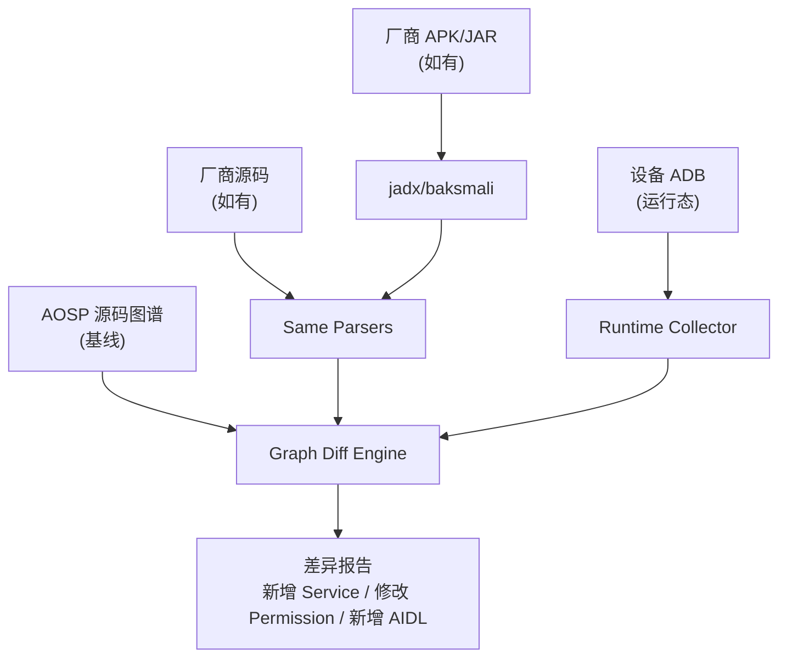

# Android Context Intelligence 项目可行性分析

## 一、项目概览

Android Context Intelligence 通过**确定性程序分析**将 AOSP 源码转换为可查询的 Android 系统上下文图谱（SQLite），覆盖 Java Symbol、AIDL/Binder、Java 继承、System Service 注册、多仓库发现等图层，最终目标是为 CTS/XTS 根因分析、Framework 修改影响分析和 AI Agent 推理提供可信事实层。

---

## 二、可行性评估：✅ 可行，且已部分验证

### 2.1 已验证的技术路径

| 模块 | 状态 | 证据 |
|---|---|---|
| Java Symbol Graph | ✅ 已实现 | Universal Ctags JSON → SQLite，全限定名解析 |
| AIDL/Binder Graph | ✅ 已实现 | AIDL 接口/方法解析，`IMPLEMENTS_BINDER` 关系 |
| Java Inheritance Graph | ✅ 已实现 | `EXTENDS` / `IMPLEMENTS_JAVA_INTERFACE`，支持递归查询 |
| Service Registration Graph | ✅ 已实现 | `ServiceManager.addService` / `publishBinderService` / `LocalServices.addService` 扫描 |
| Multi-Repository Source Config | ✅ 已实现 | repo manifest 发现，TOML 配置，语言探测，执行计划生成 |
| Atomic Database Rebuild | ✅ 已实现 | Staging → 验证 → 原子发布，故障安全 |
| 测试覆盖 | ✅ 24 项通过 | 单元 + 集成 + AMS/PMS Binder 链路验证 |

> [!IMPORTANT]
> 项目已经在 AOSP `frameworks/base` 上验证了完整链路：从 repo manifest 发现 1087 个项目 → 选择性启用仓库 → 多图层解析 → SQLite 图谱 → AMS/PMS 查询验收。**这不是纸面方案，而是已经运行的系统。**

### 2.2 技术路径合理性

1. **"事实优先"原则正确** — 用 Universal Ctags + 确定性规则生成基础图谱，不让 AI 创建事实，是避免"AI 幻觉污染图谱"的正确策略。
2. **SQLite 作为 MVP 存储合理** — 避免了 Neo4j/分布式图数据库的运维复杂度，SQLite 对单机场景足够。
3. **分层架构清晰** — Fact Layer → Context Layer → Reasoning Layer 分离明确，每层独立可测试。
4. **稳定节点 ID 设计成熟** — 使用 `类型:完整限定名` 的 ID 方案支持 upsert 和版本 diff。

---

## 三、优化空间

### 3.1 短期优化（高优先级）

#### ① Kotlin 解析器迫在眉睫

当前只有 Java/AIDL 语义解析。但 AOSP 从 Android 13 起大量引入 Kotlin（`PermissionController`、`Settings`、部分 SystemUI），**Kotlin 解析缺失意味着权限图、UI 层和部分 Mainline 模块的覆盖存在真空**。

**建议方案：**
- 第一步：使用 Universal Ctags 对 Kotlin 做基础符号提取（Ctags 已支持 Kotlin）
- 第二步：用 [kotlin-compiler-embeddable](https://mvnrepository.com/artifact/org.jetbrains.kotlin/kotlin-compiler-embeddable) 的 PSI 做精确解析
- 或使用 Tree-sitter-kotlin 做 AST 级别解析

#### ② 增量更新机制

当前是全量 rebuild。README 中也承认了这个问题。AOSP 有数百个仓库、数百万文件，全量重建在多仓启用后会很慢。

**建议方案：**
- 基于 `git diff --name-status` 的文件级变更检测
- 按文件 content hash 判断是否需要重新解析
- 变更路由到受影响的 collector 子图
- 文档中已有详细的变更路由设计（§10.2），实现即可

#### ③ Build Graph 接入

Permission Enforcement Graph 的前置是 Build Graph（Soong/Ninja），文档已有详细设计但尚未实现。这是连接"源码 → 模块 → 产物 → 分区 → 镜像"的关键缺失链路。

### 3.2 中期优化

| 优化项 | 价值 | 建议 |
|---|---|---|
| C/C++ Native Binder 解析 | 高 — HAL、native daemon 的 Binder 链路 | Joern 或 CodeQL C/C++ |
| Permission Enforcement Graph | 高 — 核心 Android 语义 | 文档已有详细 v0.1 设计 |
| SELinux Policy Graph | 中高 — CTS/VTS 失败常涉及 | Tree-sitter SELinux policy |
| Runtime Graph (ADB/dumpsys) | 中 — 连接静态与运行态 | 按需采集，不常变 |
| 跨版本 Graph Diff | 中 — 版本升级影响分析 | 需要 snapshot 机制 |

### 3.3 架构优化

#### ① NetworkX 的角色不清晰

文档提到 `SQLite + NetworkX`，但实际代码中 NetworkX 似乎并未深度使用。建议：
- SQLite 作为唯一权威存储
- 需要图遍历（BFS/DFS、路径查找）时，按需构建 NetworkX 子图
- 不要维护两份图的同步问题

#### ② 考虑 FTS5 全文搜索

SQLite 的 FTS5 扩展可以为符号名、类名、权限名提供模糊搜索能力，成本极低，对 Context Expander 非常有用。

---

## 四、核心问题：厂商代码不公开，AOSP 知识图谱是否有意义？

### 4.1 结论：**有意义，而且意义重大**

> [!TIP]
> AOSP 图谱不是"完整 Android"的图谱，而是**所有 Android 设备的公共基准线**。这恰恰是它最大的价值。

理由如下：

#### ① AOSP 是 Android 的"宪法"

所有厂商代码（Samsung OneUI、小米 MIUI、OPPO ColorOS、vivo OriginOS 等）都是在 AOSP 之上做定制。Framework 的核心架构——SystemServer 启动流程、AMS/PMS/WMS 的 Binder 架构、权限模型、SELinux 基线策略——**全部来自 AOSP**。

```text
厂商代码 = AOSP 基线 + 定制修改 + 私有扩展
```

理解 AOSP 基线就是理解 80% 以上的 Android 行为。

#### ② CTS/XTS 的测试目标就是 AOSP 接口

CTS (Compatibility Test Suite) 测试的是 **AOSP 定义的 API 和行为契约**。CTS 失败的根因分析几乎总是需要理解 AOSP 的 Service → Binder → Permission 链路。厂商定制导致的 CTS 失败，本质上是定制偏离了 AOSP 基线。

#### ③ 厂商定制是"增量"，不是"替代"

厂商很少完全重写 System Service。他们通常：
- 在 AOSP Service 中添加方法
- 新增 AIDL 接口
- 注册额外的 System Service
- 修改权限白名单
- 添加 SELinux 策略

这些都可以在 AOSP 图谱的基础上做**增量叠加**。

#### ④ 有 AOSP 基线才能看清定制差异

没有 AOSP 基线图谱，就无法回答：
- "厂商加了什么 Service？"
- "哪些 Binder 接口是厂商新增的？"
- "哪些权限检查被修改了？"

> [!NOTE]
> 对比 = AOSP 基线 + 厂商增量。没有基线就没有对比。

---

## 五、编译 AOSP 后纳入知识图谱（补充厂商定制）：是否可行？

### 5.1 结论：**可行，而且项目架构已为此准备好了**

项目的 Multi-Repository Source Configuration 已经支持：

```toml
# 添加厂商仓库
[repositories."vendor/samsung"]
enabled = true
languages = ["java", "kotlin", "aidl", "cpp"]

# 添加不在 repo manifest 中的本地目录
[[extra_repositories]]
name = "vendor-extension"
path = "/path/to/vendor/code"
enabled = true
languages = ["java", "aidl"]
```

### 5.2 三种纳入厂商代码的路径

#### 路径 A：有厂商源码（最佳）

如果你有厂商的完整源码树（例如三星 BSP、MTK BSP）：

```text
AOSP 图谱  +  vendor/ 目录  →  完整图谱
```

直接在 `source_roots.toml` 中启用 `vendor/*` 仓库，现有 Java/AIDL 解析器即可工作。

**可行性：✅ 完全可行，无需额外开发**

#### 路径 B：没有源码，但有编译产物

如果只有厂商的 `.jar` / `.apk` / `.apex` / `.so`：

1. **反编译 Java/Kotlin**：使用 `jadx` 或 `cfr` 反编译 `.jar`/`.dex` → Java 源码 → 现有解析器
2. **DEX 分析**：使用 `dexdump` / `baksmali` 提取类/方法/继承关系
3. **API 表面提取**：使用 `android.jar` + `dexlib2` 提取公开 API

```text
vendor.jar → jadx → pseudo-Java → Ctags → SQLite Graph
```

**可行性：✅ 可行，需要新增反编译前端 collector**

> [!WARNING]
> 反编译产物的质量不如源码。局部变量名、部分泛型信息和内联代码会丢失。但对于图谱的类/方法/继承/Binder 关系提取，已经足够。

#### 路径 C：没有源码也没有产物，但有设备

通过 ADB 采集运行态信息：

```bash
adb shell service list          # 所有注册的 Binder Service
adb shell dumpsys package       # 所有 Package、权限、组件
adb shell dumpsys activity      # Activity/Service 状态
adb shell cmd permission list   # 所有声明的权限
adb shell pm list packages -f   # Package → APK 路径
adb shell lshal                 # HAL 实例
```

对比 AOSP 静态图谱与设备运行态：

```text
AOSP 图谱的 Service 列表
     vs
设备 `service list` 的实际列表
     →
厂商新增 Service = 差集
```

**可行性：✅ 可行，已在 Runtime Graph 规划中**

### 5.3 建议的厂商定制补充策略



---

## 六、风险与挑战

| 风险 | 严重性 | 缓解措施 |
|---|---|---|
| AOSP 全量扫描性能 | 中 | `auto_enable_discovered = false` + 增量更新 |
| Kotlin 覆盖缺失 | 高 | 优先实现 Kotlin Ctags 提取 |
| Soong/Ninja 跨版本 schema 不稳定 | 中 | Adapter 模式 + schema probe |
| 反编译产物精度 | 低 | 标记 `confidence < 1.0`，不混入确定性事实 |
| 厂商 Native Binder (C++) 难以分析 | 高 | 后续接入 Joern/CodeQL C++ |
| 项目长期维护成本 | 中 | 工程化：CI、自动化测试、文档 |

---

## 七、总结

| 问题 | 回答 |
|---|---|
| **项目可行吗？** | ✅ 可行。核心链路已验证，技术选型合理，分层架构清晰 |
| **有优化空间吗？** | ✅ 有。Kotlin 解析、增量更新、Build Graph 是最紧迫的三项 |
| **厂商代码不公开，AOSP 图谱有意义吗？** | ✅ 有重大意义。AOSP 是所有 Android 设备的公共基准线，CTS/XTS 测试目标就是 AOSP 接口 |
| **编译 AOSP 纳入图谱可行吗？** | ✅ 完全可行。Build Graph 规划已有详细设计 |
| **补充厂商定制可行吗？** | ✅ 可行。三条路径：源码直接解析、反编译提取、ADB 运行态采集 |

> [!TIP]
> **最优策略**：先夯实 AOSP 基线图谱（补齐 Kotlin + Build Graph + Permission Graph），再通过 `source_roots.toml` 增量纳入厂商源码，最后通过 ADB Runtime Graph 做静态 ↔ 运行态对比。基线越稳固，增量越有价值。
